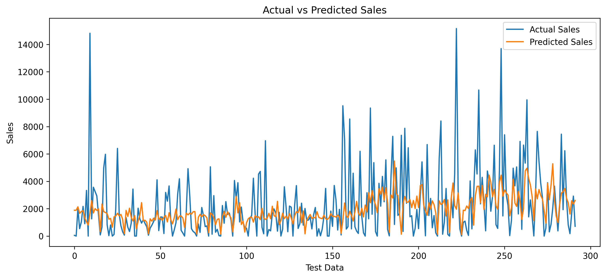
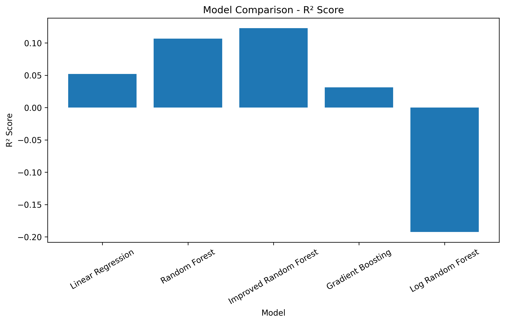

# Sales Forecasting Using Machine Learning

## Project Overview

This project focuses on forecasting daily sales using machine learning techniques.
Historical sales data was cleaned, transformed into a time-series dataset, and used
to train and compare multiple regression models.

The main objective was to understand how historical sales patterns and calendar-based
features can be used to predict future sales.
## Tech Stack

- Python
- NumPy
- Pandas
- Matplotlib
- Scikit-learn
- Joblib
- Jupyter Notebook
## Dataset

- Dataset shape: 10,800 rows × 21 columns
- Target variable: Sales
- Data frequency: Daily
- Training period: 2015-02-02 to 2018-03-13
- Testing period: 2018-03-14 to 2018-12-30

## Features

The following features were used:

- Year
- Month
- Day
- DayOfWeek
- WeekOfYear
- Lag_1
- Lag_2
- Lag_7
- Lag_14
- Lag_30

Lag features represent previous sales values and help the model learn historical
sales patterns.

## Data Preparation

The following steps were performed:

1. Converted order dates into a proper datetime format.
2. Aggregated sales on a daily basis.
3. Created calendar-based features.
4. Created lag features.
5. Removed rows containing missing values caused by lag features.
6. Used a chronological train-test split to avoid future data leakage.

## Machine Learning Models

The following models were tested:

1. Linear Regression
2. Random Forest Regressor
3. Improved Random Forest Regressor
4. Gradient Boosting Regressor
5. Log-transformed Random Forest

## Model Comparison

| Model | MAE | MSE | R² |
|---|---:|---:|---:|
| Linear Regression | 1704.06 | 6020540.92 | 0.0520 |
| Random Forest | 1605.47 | 5672919.52 | 0.1067 |
| Improved Random Forest | 1573.75 | 5570311.46 | 0.1229 |
| Gradient Boosting | 1647.39 | 6151294.65 | 0.0314 |
| Log Random Forest | 1662.30 | 7573100.53 | -0.1925 |

## Best Model

The best-performing model among the tested models was the Improved Random Forest
Regressor.

Parameters:

- n_estimators = 300
- max_depth = 15
- min_samples_split = 5
- min_samples_leaf = 2
- random_state = 42

Performance:

- MAE: 1573.75
- MSE: 5,570,311.46
- R²: 0.1229

## Visualizations

### Actual vs Predicted Sales

### Model Comparison

## Feature Importance

The most important features for the Random Forest model included:

- Lag_7
- Lag_1
- Lag_30
- Lag_14
- Lag_2

This indicates that previous sales values were more useful to the model than some
of the calendar-based features.

## Error Analysis

The model performed substantially better on normal-sales days than on high-sales
spike days.

Normal-day MAE: approximately 1104.70

High-sales-day MAE: approximately 5017.92

This shows that sudden sales spikes are difficult for the current model to predict.

## Limitations

The current model has a relatively low R² score of approximately 0.123.
Therefore, although the Improved Random Forest performed best among the tested
models, the model is not highly accurate.

The major limitation is that the available features do not sufficiently explain
large sudden sales spikes.

## Future Improvements

Possible improvements include:

- Adding promotional information
- Adding holiday and festival features
- Adding product/category-level information
- Adding customer-level features
- Using rolling mean and rolling standard deviation features
- Testing XGBoost or other advanced boosting algorithms
- Hyperparameter tuning
- Exploring dedicated time-series models
- Adding external factors that may influence sales

## Conclusion

This project demonstrates a complete machine learning workflow for a sales
forecasting problem, including data preprocessing, feature engineering,
time-based splitting, model training, model comparison, evaluation, visualization,
and error analysis.

The Improved Random Forest model achieved the best performance among the models
tested, with an MAE of 1573.75 and an R² score of 0.1229.

The project also demonstrates an important machine learning concept: model
evaluation should include analysis of where and why a model makes errors, rather
than relying only on a single performance metric.
